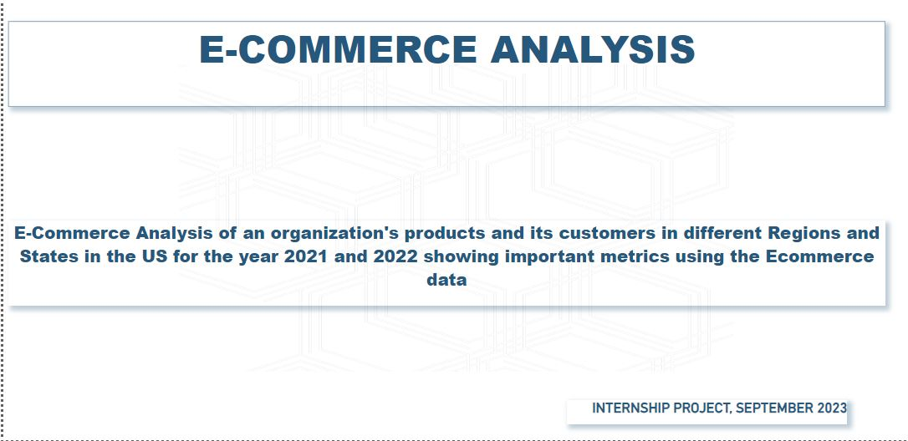
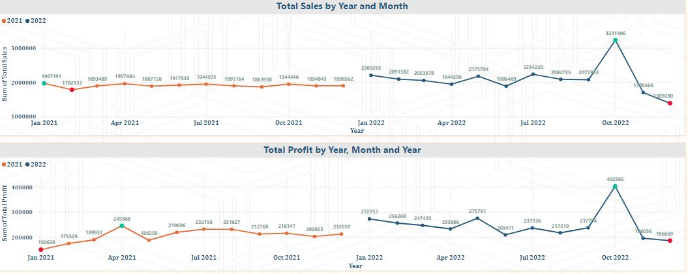

# E_commerce_Sales_Analysis
The goal was to analyze the firm’s products and its customers in different regions and states in the US for the years 2021 and 2022, showing important metrics using the provided e-commerce data

As illustrated in the Ecommerce analysis, there is a varying trend of total sales and total profit trend for the year 2021 and 2022 across January to December. 
There was almost an even distribution in total sales for 2021 with total sales being at the highest in January $1,967,191 and February being the lowest $1,782,137 whereas highest total sales was made in October for the year 2022 at $3,231,406 and lowest in December $1,389,280.
April had the highest profit $245,868 in the year 2021 and a high drop in January having total sales of  $150,628 while in the year 2022, highest total profit was made in the month of October $402,565, and the lowest profit at $186,669 in the month of December.

# Do view and download pbix. and pdf. file for full report, insights, and recommendations.
